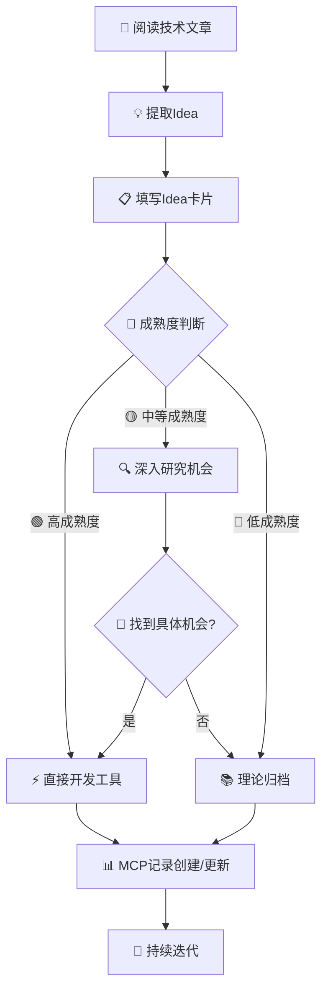
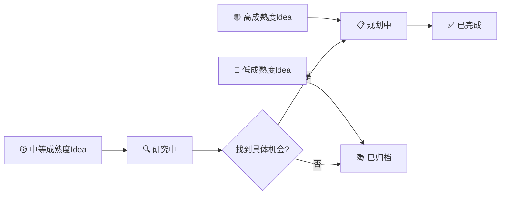

# "AI辅助从技术文章分析到工具项目开发"项目规则

> 本规则文档定义了从技术文章中提取Idea项目的标准化流程、项目组织结构和开发最佳实践。
>
> 文中"AI辅助从技术文章分析到工具项目开发"项目称为 `本项目`。
>
> 而从技术文章分析得出的工具项目称为 `Idea项目`。

## 📋 目录

1. [📖 技术文章分析规则](#技术文章分析规则)
2. [🔍 Idea项目识别标准](#idea项目识别标准)
3. [📊 简化决策支持流程](#简化决策支持流程)
4. [🏗️ 项目组织结构规则](#项目组织结构规则)
5. [🛠️ 技术栈规范](#技术栈规范)
6. [📋 开发流程规范](#开发流程规范)
7. [📝 README.md写作要求](#readmemd写作要求)
8. [🔄 项目维护规则](#项目维护规则)
9. [📊 质量评估标准](#质量评估标准)
10. [🤝 协作规范](#协作规范)
11. [📈 成功指标](#成功指标)
12. [📝 规则更新日志](#规则更新日志)

## 📖 技术文章分析规则

### 1. 技术文章分析处理流程

#### 🔄 完整分析流程

**第一阶段：文章获取与预处理**

1. **文章获取**:
   - 使用MCP工具获取当前日期时间（`get_current_datetime`）
   - 尝试使用Firecrawl MCP工具抓取文章内容
   - 如抓取失败，使用web_search工具搜索相关信息
   - 记录文章来源、标题、URL等基本信息

2. **内容预处理**:
   - 提取文章主要章节和结构
   - 识别关键技术概念和术语
   - 标记重要的图表、代码示例、案例研究
   - 整理参考文献和相关链接

**第二阶段：深度分析与理解**

3. **核心内容分析**:
   - 识别文章的主要技术观点和创新点
   - 分析技术方案的实现原理和架构
   - 提取具体的算法、框架、评估方法
   - 理解技术应用场景和使用限制

4. **价值评估**:
   - 评估技术方案的实用性和可行性
   - 分析解决的具体问题和目标用户
   - 判断技术的创新程度和市场价值
   - 识别潜在的工具开发机会

**第三阶段：Idea项目提取**

5. **Idea识别**:
   - 基于文章内容识别可工具化的概念
   - 分析每个Idea的输入输出关系
   - 评估实现的技术难度和资源需求
   - 确定Idea的成熟度等级（高/中/低）

6. **项目规划**:
   - 为高成熟度Idea制定开发计划
   - 为中等成熟度Idea制定研究计划
   - 为低成熟度Idea制定归档策略
   - 确定项目优先级和资源分配

**第四阶段：文档化与记录**

7. **创建项目结构**:
   - 在`ideaed-projects`目录下创建项目文件夹
   - 生成标准化的README.md文档
   - 创建idea-analysis.md深度分析文档
   - 使用MCP项目导航工具记录项目信息

8. **版本控制**:
   - 使用git add添加新创建的文件
   - 提交更改并添加描述性的commit信息
   - 确保项目历史记录的完整性

#### ⚡ 快速处理检查清单

**文章分析前置检查**:
- ✅ 获取当前准确日期时间
- ✅ 确认文章URL有效性
- ✅ 评估文章技术相关性
- ✅ 检查是否为重复分析

**分析过程质量控制**:
- ✅ 核心技术概念提取完整
- ✅ Idea成熟度评估准确
- ✅ 技术可行性分析充分
- ✅ 商业价值评估合理

**输出文档质量检查**:
- ✅ 项目文件夹命名规范
- ✅ README.md结构完整
- ✅ 技术分析深度充分
- ✅ MCP记录信息准确

#### 🛠️ 工具使用指南

**推荐工具优先级**:
1. **日期时间获取**: 优先使用`currentdate-mcp`的`get_current_datetime`工具
2. **文章内容抓取**: 优先使用Firecrawl MCP工具，失败时使用web_search
3. **项目记录**: 使用`project-navigator` MCP工具记录项目信息
4. **版本控制**: 使用标准git命令进行版本管理

**常见问题处理**:
- **抓取失败**: 使用web_search获取文章摘要和关键信息
- **技术概念模糊**: 进行额外的技术背景研究
- **成熟度难判断**: 倾向于保守评估，选择较低成熟度
- **项目重复**: 检查现有项目，考虑合并或差异化

### 2. 文章阅读与分析策略

**阅读策略**:

- 🎯 **目标导向**: 重点关注可实现的技术方案、决策框架、工具方法
- 🔍 **深度理解**: 分析文章的核心观点、技术原理、应用场景
- 💡 **价值提取**: 识别具有实用价值的概念、算法、评估方法等实体
- 🚀 **可行性评估**: 判断技术方案的实用性和实现难度

**分析维度**:

- **技术深度**: 是否包含具体的技术实现细节
- **实用价值**: 能否解决实际问题或提升工作效率
- **创新性**: 是否提供新的思路或改进现有方案
- **可扩展性**: 是否具备进一步开发和优化的潜力

### 2. Idea项目识别标准

#### 1. Idea成熟度评估标准

> 基于Idea的具体程度和实现清晰度，将其分为三个成熟度等级，采用不同的处理策略。

##### 🟢 高成熟度（可直接开发）

**判断标准**:

- ✅ **具体评估维度**: 有明确的评估维度（≥2个维度）
- ✅ **量化指标定义**: 有具体的指标定义（≥3个指标）
- ✅ **明确规则算法**: 有清晰的计算规则或处理逻辑
- ✅ **清晰输入输出**: 输入输出关系明确，边界清楚

**典型特征**:

- 包含评分体系或量化框架
- 有明确的决策规则或判断标准
- 提供具体的操作步骤或流程
- 可以直接转化为算法或工具逻辑

**处理策略**: 直接评估开发资源和优先级，进入开发流程

**示例**: AI决策框架（7个指标、3个维度、明确评分规则）

##### 🟡 中等成熟度（需深入研究）

**判断标准**:

- ✅ **概念框架完整**: 有完整的理论体系或概念框架
- ❓ **实现细节缺失**: 缺乏具体的实现细节或操作标准
- ❓ **工具机会模糊**: 需要进一步分析才能提取具体工具机会
- ✅ **价值方向明确**: 文章中明确或暗示工具开发方向

**典型特征**:

- 提出了系统性的理论框架
- 描述了核心价值和应用场景
- 在"实践启发"或类似章节提到工具机会
- 概念清晰但缺乏具体实现路径

**处理策略**: 深入研究工具开发机会，寻找可具体化的实现点

**示例**: DTS理论研究（8大价值框架，但需挖掘具体工具实现）

##### 🔴 低成熟度（仅做归档）

**判断标准**:

- ❓ **抽象概念描述**: 仅有抽象的概念或理论描述
- ❌ **无实现路径**: 缺乏明确的实现路径或应用方向
- ❌ **无具体场景**: 缺乏具体的应用场景或使用案例
- ❌ **工具价值不明**: 无法明确识别出工具开发价值

**典型特征**:

- 纯理论探讨或概念介绍
- 缺乏实际应用指导
- 无法直接转化为实用工具
- 主要价值在于知识积累

**处理策略**: 理论归档，作为知识资产保存，定期回顾评估

#### 2. Idea提取标准化模板

**Idea提取卡片**:

```markdown
## Idea提取卡片

### 基本信息
- **Idea英文名称**: [用于创建项目文件夹的英文名称，使用小写字母和连字符]
- **Idea中文名称**: [用于显示的中文名称，简洁准确的描述]
- **来源文章标题**: [文章标题]
- **来源文章URL**: [文章完整链接地址]
- **文章领域**: [IT/管理/法律/政策等]
- **提取日期**: [YYYY-MM-DD]（AI Agent应调用mcp工具获取当前日期，因为会话时间可能不准确）

### 核心内容
- **核心概念**: [关键理论或方法论]
- **主要维度**: [如有的话，列出主要评估维度]
- **关键指标**: [如有的话，列出具体指标]
- **输入输出**: [如有的话，明确输入输出关系]

### 成熟度评估
- **成熟度等级**: [🟢高/🟡中/🔴低]
- **判断依据**: [基于哪些标准做出判断]
- **缺失要素**: [如果不是高成熟度，缺少哪些要素]

### 处理决策
- **下一步行动**: [开发/研究/归档]
- **预估投入**: [时间和资源估算]
- **优先级**: [高/中/低]
- **备注**: [其他重要信息]
- **利益相关人**: [应该推荐给（关注此Idea）的人/行业/职业]
```

#### 3. 合格Idea项目特征

- ✅ **明确需求**: 有清晰的问题定义和解决目标
- ✅ **技术可行**: 基于现有技术栈可以实现
- ✅ **实用价值**: 能够提供实际的业务或开发价值
- ✅ **独立性**: 可以作为独立Idea项目进行开发和维护

**特殊情况处理**:

- 📄 **纯理论文章**: 当技术文章中没有提取出具体可用的Idea项目时，仅需创建项目简介文档（如README.md），记录文章的核心观点、技术洞察和理论价值，无需进一步的开发组织和代码实现
- 📚 **知识归档**: 此类Idea项目主要用于知识管理和技术积累，为后续相关Idea项目提供理论基础和参考资料
- 🔗 **关联引用**: 在后续开发相关Idea项目时，可以引用这些理论基础项目作为技术背景

**Idea项目类型分类**:

- 🔧 **工具类**: 提升开发效率的实用工具
- 📊 **分析类**: 数据分析、决策支持系统
- 🤖 **AI应用**: 基于AI技术的智能应用
- 🌐 **Web服务**: 提供在线服务的Web应用
- 📚 **框架类**: 可复用的开发框架或库
- 📦 **其他类**: 未列出的其他应用工具

#### 4. 中等成熟度Idea的工具机会追踪

**工具机会识别方法**:

1. **寻找具体化线索**:

   - 文章中的"实践启发"、"工具开发机会"章节
   - 提到的具体问题和解决思路
   - 案例分析中的可工具化环节
2. **机会成熟度评估**:

   ```markdown
   ## 工具机会追踪

   ### 来源Idea: [理论名称]

   #### 机会1: [工具名称]
   - **成熟度**: 🟢可开发 / 🟡需研究 / 🔴不明确
   - **输入**: [如果明确]
   - **输出**: [如果明确]  
   - **缺失要素**: [如果需要补充]

   #### 机会2: [工具名称]
   - ...
   ```
3. **转化路径**:

   - 🟢 **可开发机会**: 直接转为高成熟度Idea，进入开发流程
   - 🟡 **需研究机会**: 继续深入研究，补充缺失要素
   - 🔴 **不明确机会**: 暂时保留，等待更多信息

#### 5. 简化工作流程



### 3. 简化决策支持流程

> 基于Idea成熟度的直接判断，简化决策流程，避免过度分析。

#### 🎯 基于成熟度的决策支持

**决策逻辑**:

- **🟢 高成熟度Idea** → 评估开发资源 → 确定优先级 → 立即开发
- **🟡 中等成熟度Idea** → 投入研究时间 → 寻找工具机会 → 转化或归档
- **🔴 低成熟度Idea** → 直接归档 → 定期回顾评估

**简化评估卡片**:

```markdown
## 快速决策卡片

### 基本信息
- **Idea名称**: [名称]
- **成熟度**: [🟢/🟡/🔴]
- **来源**: [文章链接]

### 决策要素
- **开发资源**: [充足/有限/不足]
- **业务价值**: [高/中/低]
- **技术难度**: [简单/中等/复杂]

### 决策结果
- **行动**: [开发/研究/归档]
- **优先级**: [高/中/低]
- **预计投入**: [时间估算]
```

#### ⚡ 快速复杂度评估

**三级复杂度**:

- 🟢 **简单** (1-4周): 单一功能，标准技术栈，基础处理逻辑
- 🟡 **中等** (1-2个月): 多模块集成，复杂业务逻辑，第三方集成
- 🔴 **复杂** (2个月以上): 分布式架构，算法研发，高性能要求

**快速判断标准**:

- **功能数量**: 单功能→简单，多功能→中等，系统级→复杂
- **技术栈**: 标准栈→简单，集成栈→中等，创新栈→复杂
- **数据处理**: 基础→简单，分析→中等，实时→复杂

#### 💡 简化决策支持

**基本决策检查**:

- ✅ **值得开发吗？**

  - 解决真实问题？
  - 有明确用户？
  - 实现路径清晰？
- ✅ **现在开发吗？**

  - 资源是否充足？
  - 优先级是否足够高？
  - 技术风险是否可控？
- ✅ **如何开发？**

  - 选择合适的技术栈
  - 确定开发周期
  - 明确完成标准

**快速决策原则**:

1. **🟢 高成熟度** → 快速决策 → 立即行动
2. **🟡 中等成熟度** → 深入研究 → 找到机会
3. **🔴 低成熟度** → 直接归档 → 定期回顾

**避免过度分析**:

- 不要为简单决策构建复杂流程
- 基于直觉和经验快速判断
- 在行动中验证和调整

## 🏗️ 项目组织结构规则

### 1. 目录结构标准

```
项目根目录/
├── README.md                   # 项目集合总体说明
├── .trae/
│   └── rules/
│       └── project_rules.md    # 本规则文件
├── navigator/                  # 本项目导航系统后端
│   ├── app/
│   │   ├── main.py            # FastAPI应用主入口
│   │   ├── models.py          # 数据模型定义
│   │   ├── database.py        # 数据库连接配置
│   │   └── crud.py            # 数据库操作接口
│   ├── pyproject.toml         # 后端项目配置
│   └── projects.db            # SQLite数据库文件
├── mcp_tool/                   # MCP工具目录
│   ├── project_navigator_mcp/  # MCP服务器包
│   │   ├── __init__.py
│   │   ├── __main__.py
│   │   ├── mcp_server.py      # 标准MCP实现
│   │   └── mcp_server_fastmcp.py # FastMCP实现（推荐）
│   ├── dist/                  # 构建产物
│   │   └── project_navigator_mcp-1.0.0-py3-none-any.whl
│   ├── pyproject.toml         # MCP工具配置
│   └── README.md              # MCP工具使用说明
├── ideaed-projects/           # Web前端本项目导航界面
│   └── project-navigator-web/
│       ├── index.html         # 本项目导航主页面
│       ├── style.css          # 样式文件
│       ├── script.js          # 交互逻辑
│       └── README.md          # 前端使用说明
├── docs/                      # 全局文档目录
│   └── 项目结构图.md          # 项目结构说明
└── ideaed-projects/           # 所有Idea项目的统一目录
    └── [项目名称]/            # Idea项目目录
        ├── README.md          # 项目说明文档
        ├── idea-analysis.md   # 项目理念分析（可选）
        ├── pyproject.toml     # Python项目配置（如适用）
        ├── .python-version    # Python版本指定（如适用）
        ├── Makefile          # 开发命令集合（如适用）
        ├── .gitignore        # Git忽略规则（如适用）
        ├── .env.example      # 环境变量示例（如适用）
        ├── main.py           # 主程序入口（如适用）
        ├── run.py            # 运行脚本（如适用）
        ├── docs/             # 项目文档目录（如适用）
        ├── examples/         # 示例代码（如适用）
        ├── tests/            # 测试代码（如适用）
        ├── static/           # 静态资源（如适用）
        └── assets/           # 项目资源（如适用）
```

**目录结构说明**:

- 🏗️ **navigator/**: 本项目导航系统后端，基于FastAPI + SQLite的API服务，提供Idea项目CRUD操作
- 🔧 **mcp_tool/**: MCP(Model Context Protocol)工具包，提供AI Agent集成能力，支持uvx调用
- 🌐 **project-navigator-web/**: Web前端界面，提供本项目导航的可视化管理和查看功能
- 📁 **ideaed-projects/**: 所有Idea项目的统一容器目录，每个Idea项目有独立的子目录
- 📄 **README.md**: 每个项目必须包含的核心文档，描述项目概况和使用方法
- 📝 **idea-analysis.md**: 可选文档，用于记录项目的理念分析和深度思考
- 🔧 **技术文件**: 根据项目类型和需求，选择性包含相应的技术配置文件
- 📚 **理论类Idea项目**: 对于纯理论归档的Idea项目，通常只包含 README.md 和 idea-analysis.md
- 🛠️ **工具类Idea项目**: 对于实际开发的Idea项目，包含完整的技术栈配置和代码结构

### 2. 命名规范

**Idea项目命名**:

- **英文名称（用于文件夹）**: 使用小写字母和连字符: `ai-decision-framework`
- **中文名称（用于显示）**: 简洁准确的中文描述: `AI决策框架工具`
- **命名原则**:
  - 英文名称体现项目核心功能: `text-analyzer`, `api-gateway`
  - 中文名称便于理解和展示，避免过于技术化的表述
  - 避免过长或过于抽象的名称
  - 英文名称用于创建项目文件夹和技术标识
  - 中文名称用于界面显示和用户交互

**文件命名**:

- Python文件: 小写字母+下划线 `decision_engine.py`
- 文档文件: 小写字母+连字符 `case-studies.md`
- 配置文件: 标准名称 `pyproject.toml`, `Makefile`

### 3. Idea项目记录管理系统

> **系统化管理**: 使用三层架构的本项目导航系统替代手动维护的项目导航.md文件，实现自动化的Idea项目记录管理。

#### 🏗️ 三层架构系统

**系统组成**:

- 🗄️ **数据层**: SQLite数据库 + SQLAlchemy ORM
- 🚀 **API层**: FastAPI后端服务，提供RESTful接口
- 🌐 **展示层**: Web前端界面 + MCP工具集成

**核心优势**:

- ✅ **自动化管理**: 通过API和MCP工具自动创建、更新Idea项目记录
- 🔍 **强大搜索**: 支持类型、状态、成熟度等多维度筛选
- 📊 **实时统计**: 自动生成Idea项目统计和分布数据
- 🤖 **AI集成**: 通过MCP协议与AI Agent无缝集成
- 🌐 **可视化**: Web界面提供直观的Idea项目管理体验

#### 📝 Idea项目记录标准

**数据模型结构**:

```python
class Project:
    id: int                    # Idea项目唯一标识
    name: str                  # Idea项目英文名称（用于创建项目文件夹）
    chinese_name: str          # Idea项目中文名称（用于显示）
    project_type: str          # Idea项目类型 (工具类/分析类/AI应用/理论类等)
    maturity: str              # 成熟度 (🟢 高/🟡 中/🔴 低)
    status: str                # 状态 (✅ 完成/🔍 研究中/📋 规划中/📚 已归档)
    description: str           # Idea项目描述
    readme_path: str           # README文件路径
    source_url: str            # 引用原文URL（可选）
    created_date: str          # 创建日期
```

**Idea项目记录操作**:

- 📝 **创建记录**: 通过MCP工具 `add_project` （推荐）或Web界面创建
  - 需要提供英文名称（用于文件夹）和中文名称（用于显示）
  - 可选提供source_url（引用原文URL）用于追溯来源
  - 英文名称将用于创建项目目录结构
  - 中文名称将在界面和搜索中显示
- 📋 **查看记录**: 通过MCP工具 `list_projects` （推荐）或Web界面查看
- 🔍 **搜索记录**: 通过MCP工具 `search_projects` （推荐）或Web界面搜索
  - 支持按中文名称和英文名称搜索
- 🔄 **更新记录**: 通过MCP工具 `update_project_status` （推荐）或Web界面更新
- 📊 **统计信息**: 通过MCP资源 `project://navigator/summary` （推荐）获取

#### 🔧 MCP工具集成

**MCP工具支持**:

- 🤖 **AI Agent集成**: 支持Claude Desktop、Cursor、TRAE IDE等
- 📦 **uvx部署**: 支持 `project-navigator-mcp-fast` 快速调用
- 🔄 **实时同步**: MCP工具操作直接更新SQLite数据库
- 📊 **智能查询**: AI Agent可以自然语言查询Idea项目信息

**使用示例**:

```bash
# 通过uvx调用MCP工具
uvx --from ./mcp_tool/dist/project_navigator_mcp-1.0.0-py3-none-any.whl project-navigator-mcp-fast
```

#### 🌐 Web界面管理

**功能特性**:

- 📋 **Idea项目列表**: 分页显示，支持筛选和排序
- 🔍 **搜索功能**: 实时搜索Idea项目名称和描述
- 📊 **统计概览**: Idea项目类型分布、状态统计等
- 📝 **详情查看**: 点击查看Idea项目完整信息
- 🔗 **直接跳转**: 支持直接访问Idea项目README文件

**访问方式**:

```bash
# 启动Navigator后端服务
cd navigator && uvicorn app.main:app --reload --port 8000

# 访问Web界面
http://localhost:8000/static/index.html
```

#### 📊 Idea项目状态管理

**状态定义**:

- 📋 **规划中**: 高成熟度Idea，已确定开发，正在评估资源和优先级
- 🔍 **研究中**: 中等成熟度Idea，正在深入研究具体工具开发机会
- ✅ **已完成**: 工具开发完成，功能稳定可用，文档完善
- 📚 **已归档**: 低成熟度Idea或无法开发的理论，作为知识资产保存

**状态流转规则**:

- 🟢 **高成熟度Idea** → 📋 规划中 → ✅ 已完成
- 🟡 **中等成熟度Idea** → 🔍 研究中 → 📋 规划中 → ✅ 已完成
- 🔴 **低成熟度Idea** → 📚 已归档

#### 🔄 维护流程

**自动化维护**:

- ✅ **数据一致性**: 数据库约束确保数据完整性
- 🔄 **状态同步**: MCP工具和Web界面实时同步
- 📊 **统计更新**: 自动计算和更新Idea项目统计信息
- 🔍 **搜索索引**: 支持全文搜索和多维度筛选

**手动维护**:

- 📝 **README更新**: Idea项目README文件需要手动维护
- 🔗 **路径检查**: 定期检查README路径的有效性
- 📚 **内容质量**: 确保Idea项目描述和文档的准确性

## 🛠️ 技术栈规范

### 1. Python Idea项目标准

**包管理器**: 优先使用 `uv`

- 快速依赖解析和安装
- 现代化的项目管理
- 与传统pip兼容

**Idea项目配置**: 使用 `pyproject.toml`

- 统一的Idea项目元数据
- 依赖管理配置
- 工具配置集中化

**开发工具链**:

- 🎨 **代码格式化**: Black
- 🔍 **代码检查**: Ruff + MyPy
- 🧪 **测试框架**: pytest
- 📊 **覆盖率**: coverage
- 🔧 **构建工具**: Makefile

### 2. Web应用标准

**后端框架**: FastAPI

- 现代化的API开发
- 自动文档生成
- 高性能异步支持

**前端技术**: 原生HTML/CSS/JS

- 轻量级实现
- 快速原型开发
- 易于维护和扩展

**部署方式**: Uvicorn

- ASGI服务器
- 开发和生产环境支持
- 热重载功能

### 3. MCP集成标准

**MCP工具开发**: 支持Model Context Protocol

- 📦 **FastMCP框架**: 优先使用FastMCP避免异步复杂性
- 🔧 **uvx部署**: 支持uvx工具安装和调用
- 🤖 **AI Agent集成**: 兼容Claude Desktop、Cursor等IDE
- 📊 **数据同步**: 与SQLite数据库实时同步

**MCP工具特性**:

- ✅ **工具函数**: 提供CRUD操作能力
- 📋 **资源访问**: 支持Idea项目信息和统计数据访问
- 🔍 **智能查询**: 支持自然语言Idea项目搜索
- 🔄 **状态管理**: 自动化Idea项目状态流转

## 📋 开发流程规范

### 1. Idea项目初始化

**步骤清单**:

1. 📁 创建Idea项目目录结构
2. 📝 编写Idea项目配置文件
3. 🔧 设置开发工具链
4. 📚 创建基础文档
5. 🧪 建立测试框架
6. 🚀 配置运行环境

**质量检查**:

- ✅ 依赖安装成功
- ✅ 测试用例通过
- ✅ 代码质量检查通过
- ✅ 服务正常启动
- ✅ 文档完整可读

### 2. 简化Idea项目状态管理

**Idea项目状态定义**:

- 📋 **规划中**: 高成熟度Idea，已确定开发，正在评估资源和优先级
- 🔍 **研究中**: 中等成熟度Idea，正在深入研究具体工具开发机会
- ✅ **已完成**: 工具开发完成，功能稳定可用，文档完善
- 📚 **已归档**: 低成熟度Idea或无法开发的理论，作为知识资产保存

**状态流转逻辑**:



**状态更新要求**:

- 及时更新本项目导航文件中的状态
- 记录状态变更的时间和原因
- 维护简洁的更新日志

### 3. 代码质量标准

**代码规范**:

- 遵循PEP 8编码规范
- 使用类型注解
- 编写清晰的文档字符串
- 保持函数和类的单一职责

**测试要求**:

- 单元测试覆盖率 > 80%
- 集成测试覆盖主要功能
- 性能测试（如适用）
- 错误处理测试

**文档标准**:

- README.md包含完整的使用说明
- API文档自动生成
- 提供使用示例
- 维护更新日志

### 4. README.md写作要求

**必备章节结构**:

```markdown
# Idea项目名称

## 📖 Idea项目简介

### 🌟 Idea项目背景/来源
- **灵感来源**: 明确说明Idea项目的技术文章来源或理论基础
- **原文链接**: 提供相关技术文章或参考资料的链接
- **技术洞察**: 总结核心技术理念和架构思想
- **现状痛点**: 分析当前领域存在的问题和挑战
  - 技术门槛高
  - 工具局限性
  - 成本压力
  - 部署复杂等
- **技术突破**: 说明Idea项目采用的创新技术方案和架构模式

### 💎 Idea项目核心价值

#### 🎯 技术价值突破
- **架构创新**: 描述技术架构的创新点和优势
- **开发效率**: 量化开发效率的提升程度
- **实时响应**: 说明系统的响应性能特点
- **部署简化**: 描述部署流程的简化程度

#### 💼 商业价值实现
- **成本革命**: 量化成本节省效果
- **上手速度**: 描述学习曲线和使用便利性
- **专业输出**: 对比同类商业工具的效果
- **数据主权**: 强调数据安全和隐私保护

#### 🔧 技术生态优势
- **核心技术栈**: 说明主要技术组件的优势
- **性能增强**: 描述性能优化特点
- **生态赋能**: 说明与现有技术生态的融合
- **可扩展性**: 描述架构的扩展能力

### 🎯 Idea项目目标和核心功能
- Idea项目的主要目标和愿景
- 核心功能列表
- 解决的具体问题
- 目标用户群体

### 🌟 主要特性和优势
- 突出的技术特性
- 相比同类产品的优势
- 独特的价值主张

## 🚀 快速开始
- 环境要求
- 安装步骤
- 基本使用示例

## 📋 功能特性
- 详细功能列表
- 技术亮点
- 性能指标

## 🛠️ 安装配置
- 详细安装说明
- 环境变量配置
- 依赖项说明

## 💡 使用示例
- 基础用法
- 高级功能
- 代码示例

## 📚 API文档
- 接口说明
- 参数描述
- 返回值格式

## 🧪 测试
- 测试运行方法
- 测试覆盖率
- 测试用例说明

## 🔧 开发指南
- 开发环境搭建
- 代码规范
- 贡献指南

## 📈 性能
- 性能基准
- 优化建议
- 资源消耗

## 🤝 贡献
- 贡献流程
- 代码提交规范
- 问题反馈

## 📄 许可证
- 开源协议
- 使用限制

## 📞 联系方式
- 维护者信息
- 技术支持
```

**写作规范**:

- 📝 **语言风格**: 简洁明了，避免冗余描述
- 🎯 **用户导向**: 从用户角度组织内容，突出实用性
- 📊 **结构清晰**: 使用标题层级和列表，便于快速浏览
- 🔗 **链接完整**: 提供相关文档和资源的有效链接
- 📸 **图文并茂**: 适当使用截图、图表和代码示例
- ✅ **信息准确**: 确保所有信息与实际代码保持同步

**质量检查清单**:

- ✅ Idea项目简介清晰明确
- ✅ 安装步骤可执行
- ✅ 使用示例可运行
- ✅ API文档完整
- ✅ 链接全部有效
- ✅ 代码示例正确
- ✅ 版本信息最新

## 🔄 Idea项目维护规则

### 1. 版本管理

**版本号规范**: 遵循语义化版本控制

- `MAJOR.MINOR.PATCH`
- 重大变更增加MAJOR
- 新功能增加MINOR
- 问题修复增加PATCH

**发布流程**:

1. 代码质量检查
2. 测试用例验证
3. 文档更新
4. 版本标记
5. 发布说明

### 2. 依赖管理

**依赖更新策略**:

- 定期检查依赖更新
- 优先安全补丁
- 测试兼容性
- 记录变更影响

**安全考虑**:

- 定期安全扫描
- 及时修复漏洞
- 避免使用过时依赖
- 最小权限原则

### 3. 性能优化

**监控指标**:

- 响应时间
- 内存使用
- CPU占用
- 错误率

**优化策略**:

- 代码性能分析
- 数据库查询优化
- 缓存策略实施
- 资源使用优化

## 📊 质量评估标准

### 1. Idea项目成熟度评估

**评估维度**:

- 🎯 **功能完整性**: 核心功能是否完整实现
- 🔧 **代码质量**: 代码规范、测试覆盖率
- 📚 **文档完善度**: 文档的完整性和可读性
- 🚀 **易用性**: 安装、配置、使用的便利性
- 🔄 **可维护性**: 代码结构、扩展性

**评分标准**:

- ⭐⭐⭐⭐⭐ 优秀 (90-100分)
- ⭐⭐⭐⭐ 良好 (80-89分)
- ⭐⭐⭐ 一般 (70-79分)
- ⭐⭐ 需改进 (60-69分)
- ⭐ 不合格 (<60分)

### 2. 持续改进机制

**改进触发条件**:

- 用户反馈问题
- 性能瓶颈发现
- 安全漏洞报告
- 技术栈更新

**改进流程**:

1. 问题识别和分析
2. 解决方案设计
3. 实施和测试
4. 文档更新
5. 效果评估

## 🤝 协作规范

### 1. 团队协作

**角色定义**:

- 🏗️ **架构师**: 技术方案设计
- 💻 **开发者**: 功能实现
- 🧪 **测试工程师**: 质量保证
- 📝 **文档维护者**: 文档编写和维护

**协作流程**:

- 需求分析和设计评审
- 代码审查机制
- 测试和质量检查
- 文档同步更新

### 2. 知识管理

**知识积累**:

- 技术决策记录
- 最佳实践总结
- 问题解决方案库
- 经验教训分享

**知识传承**:

- 定期技术分享
- 文档持续更新
- 代码注释完善
- 培训和指导

## 📈 成功指标

### 1. Idea项目成功标准

**技术指标**:

- ✅ 功能需求100%实现
- ✅ 测试覆盖率>80%
- ✅ 代码质量检查通过
- ✅ 性能指标达标

**业务指标**:

- 🎯 解决实际问题
- 📈 提升工作效率
- 💡 提供创新价值
- 🔄 具备扩展潜力

### 2. 长期目标

**生态建设**:

- 构建完整的Idea项目生态
- 形成标准化的开发流程
- 建立知识共享机制
- 培养技术创新能力

**价值创造**:

- 提升团队技术水平
- 积累可复用的技术资产
- 推动技术标准化
- 促进知识传播和应用

---

## 📝 规则更新日志

### v1.3.2 (2025-01-28)

- 🔗 **新增原文URL追溯：完善Idea项目来源管理**
  - 📝 **数据模型扩展**: 在Project类中新增 `source_url`字段，用于记录引用原文URL
  - 📋 **卡片模板优化**: 更新Idea提取卡片模板，分离"来源文章标题"和"来源文章URL"字段
  - 🔧 **MCP工具增强**: 更新 `add_project`函数，支持source_url参数传递
  - 💾 **数据库结构更新**: SQLAlchemy和Pydantic模型同步添加source_url字段
  - 🖥️ **CLI工具优化**: 交互式创建项目时支持输入原文URL
  - 📊 **记录操作完善**: 创建记录时可选提供source_url用于追溯来源
  - 📚 **文档标准化**: 明确原文URL在Idea项目记录中的作用和使用规范

### v1.3.1 (2025-01-28)

- 📝 **新增中文名称支持**：Idea项目记录时应记录中文名称
  - 🏷️ 数据模型新增 `chinese_name` 字段（用于显示）
  - 📁 明确 `name` 字段为英文名称（用于创建项目文件夹）
  - 📋 更新Idea提取卡片模板，分离英文名称和中文名称
  - 🎯 完善命名规范，明确英文名称和中文名称的使用场景
  - 🔍 MCP工具操作支持中文名称搜索和显示
  - 🌐 Web界面优化，优先显示中文名称提升用户体验

### v1.3.0 (2025-07-10)

- 🏗️ **架构革新：从手动导航向MCP系统化管理转型**
  - 🗄️ **引入三层架构**: SQLite数据库 + FastAPI后端 + Web前端 + MCP工具集成
  - 🤖 **MCP工具标准**: 新增FastMCP框架标准，支持uvx部署和AI Agent集成
  - 📊 **自动化管理**: 替代手动维护本项目导航.md，实现Idea项目记录的自动化CRUD操作
  - 🌐 **可视化界面**: Web界面提供项目列表、搜索筛选和统计概览功能
  - 🔄 **实时同步**: MCP工具操作与数据库实时同步，支持AI Agent智能查询
  - 📝 **数据模型标准**: 定义标准化的Project数据模型和操作接口
  - 🛠️ **技术栈扩展**: 新增MCP集成标准，包含FastMCP框架和uvx部署规范
  - 🔍 **多维搜索**: 支持类型、状态、成熟度等多维度筛选和全文搜索

### v1.2.0 (2025-07-08)

- 🎯 **重大简化优化：基于用户反馈的流程简化**
  - 📊 **新增Idea成熟度评估标准**：建立高/中/低三级成熟度判断体系
  - 📋 **标准化Idea提取模板**：提供结构化的Idea提取卡片格式
  - 🔄 **简化工作流程**：基于成熟度的直接决策路径
  - 📊 **更新本项目导航格式**：增加成熟度和状态标识列
  - ⚡ **简化项目状态管理**：从5个状态精简为4个状态
  - 🎯 **简化决策支持流程**：移除复杂评估体系，采用基于成熟度的快速决策
  - 🔧 **中等成熟度Idea处理**：专门的工具机会追踪机制
  - 💡 **避免过度设计**：保持项目简洁性，专注核心价值创造

### v1.1.0 (2025-07-03)

- 📊 **新增工具评估与决策流程章节**（已在v1.2.0中简化）
  - 🎯 建立四维度实用性评估体系（问题解决度、市场需求度、技术创新度、易用性指数）
  - 🏗️ 定义四级开发复杂度分析框架（简单/中等/复杂/极复杂）
  - 💡 制定标准化开发建议报告模板
  - 🎯 构建优先级评估矩阵和决策支持指标
  - 📋 建立用户决策支持检查清单和流程
  - 🔄 完善从工具识别到项目决策的完整流程
- 📋 更新目录结构，新增第3章节
- 🎯 优化决策支持体系，提升项目选择的科学性

### v1.0.0 (2025-07-01)

- ✅ 初始版本创建
- ✅ 定义技术文章分析规则
- ✅ 建立项目组织结构标准
- ✅ 制定开发流程规范
- ✅ 设立质量评估标准

---

*本规则文档将根据本项目实践经验持续更新和完善*
*维护者: petrepost*
*最后更新: 2025-01-28 (v1.3.1 中文名称支持版)*
