# VSCode Mermaid 配置指南

## 📋 概述

本指南将帮助您在 VSCode 中配置最新版本的 Mermaid 图表支持，实现在 Markdown 文件中完美显示和编辑 Mermaid 图表。

## 🚀 快速配置

### 1. 安装必要的 VSCode 扩展

#### 主要扩展（必装）

1. **Markdown Preview Mermaid Support** <mcreference link="https://marketplace.visualstudio.com/items?itemName=bierner.markdown-mermaid" index="1">1</mcreference>
   - 扩展ID: `bierner.markdown-mermaid`
   - 当前支持 Mermaid 版本: **11.6.0** <mcreference link="https://marketplace.visualstudio.com/items?itemName=bierner.markdown-mermaid" index="1">1</mcreference>
   - 功能: 在 VSCode 内置 Markdown 预览中显示 Mermaid 图表

2. **Mermaid Preview** <mcreference link="https://marketplace.visualstudio.com/items?itemName=vstirbu.vscode-mermaid-preview" index="5">5</mcreference>
   - 扩展ID: `vstirbu.vscode-mermaid-preview`
   - 功能: 专门的 Mermaid 图表预览器，支持实时编辑
   - 特色: 由 Mermaid.js 官方团队维护 <mcreference link="https://marketplace.visualstudio.com/items?itemName=vstirbu.vscode-mermaid-preview" index="5">5</mcreference>

#### 可选扩展（推荐）

3. **Markdown Preview Enhanced**
   - 扩展ID: `shd101wyy.markdown-preview-enhanced`
   - 功能: 增强的 Markdown 预览功能

### 2. 安装扩展的方法

#### 方法一：通过 VSCode 扩展市场

1. 打开 VSCode
2. 按 `Ctrl+Shift+X` 打开扩展面板
3. 搜索并安装以下扩展：
   - `bierner.markdown-mermaid`
   - `vstirbu.vscode-mermaid-preview`

#### 方法二：通过命令行

```bash
# 安装 Markdown Preview Mermaid Support
code --install-extension bierner.markdown-mermaid

# 安装 Mermaid Preview
code --install-extension vstirbu.vscode-mermaid-preview

# 安装 Markdown Preview Enhanced（可选）
code --install-extension shd101wyy.markdown-preview-enhanced
```

## ⚙️ 配置文件设置

### 1. VSCode 设置配置

已为您创建 `.vscode/settings.json` 文件，包含以下配置：

```json
{
  "markdown-mermaid.lightModeTheme": "default",
  "markdown-mermaid.darkModeTheme": "dark",
  "markdown-mermaid.languages": ["mermaid"],
  "markdown.styles": [
    "https://use.fontawesome.com/releases/v6.0.0/css/all.css"
  ],
  "markdown.preview.breaks": true,
  "markdown.preview.linkify": true,
  "markdown.preview.typographer": true,
  "markdown.extension.preview.autoShowPreviewToSide": true,
  "mermaidPreview.theme": "default",
  "mermaidPreview.backgroundColor": "transparent",
  "files.associations": {
    "*.mmd": "mermaid"
  }
}
```

### 2. Markdown Preview Enhanced 配置

已更新 `.markdown-preview-enhanced.json` 文件，配置最新的 Mermaid 版本：

```json
{
  "mermaidJSPath": "https://cdn.jsdelivr.net/npm/mermaid@11.6.0/dist/mermaid.min.js",
  "mermaidTheme": "default",
  "mermaidConfig": {
    "theme": "default",
    "themeVariables": {
      "primaryColor": "#ff6b6b",
      "primaryTextColor": "#fff",
      "primaryBorderColor": "#ff6b6b",
      "lineColor": "#333",
      "sectionBkgColor": "#fff",
      "altSectionBkgColor": "#f8f9fa",
      "gridColor": "#e1e5e9",
      "secondaryColor": "#4ecdc4",
      "tertiaryColor": "#ffe66d"
    },
    "flowchart": {
      "htmlLabels": true,
      "curve": "basis"
    },
    "sequence": {
      "diagramMarginX": 50,
      "diagramMarginY": 10,
      "actorMargin": 50,
      "width": 150,
      "height": 65,
      "boxMargin": 10,
      "boxTextMargin": 5,
      "noteMargin": 10,
      "messageMargin": 35,
      "mirrorActors": true,
      "bottomMarginAdj": 1,
      "useMaxWidth": true
    },
    "gantt": {
      "titleTopMargin": 25,
      "barHeight": 20,
      "fontFamily": "\"trebuchet ms\", verdana, arial",
      "fontSize": 11,
      "fontWeight": "normal",
      "gridLineStartPadding": 35,
      "bottomPadding": 5,
      "leftPadding": 75,
      "topPadding": 50,
      "rightPadding": 75
    }
  }
}
```

## 🎨 支持的图表类型

根据最新的 Mermaid 11.6.0 版本，支持以下图表类型： <mcreference link="https://marketplace.visualstudio.com/items?itemName=vstirbu.vscode-mermaid-preview" index="5">5</mcreference>

- ✅ **流程图 (Flowchart)**
- ✅ **时序图 (Sequence)**
- ✅ **块图 (Block)**
- ✅ **类图 (Class)**
- ✅ **实体关系图 (Entity Relationship)**
- ✅ **甘特图 (Gantt)**
- ✅ **思维导图 (Mindmap)**
- ✅ **状态图 (State)**
- ✅ **时间线 (Timeline)**
- ✅ **Git图 (Gitgraph)**
- ✅ **C4图 (C4)**
- ✅ **桑基图 (Sankey)**
- ✅ **饼图 (Pie chart)**
- ✅ **象限图 (Quadrant)**
- ✅ **需求图 (Requirement)**
- ✅ **用户旅程图 (User Journey)**
- ✅ **XY图表 (XY chart)**
- ✅ **看板图 (Kanban)**
- ✅ **架构图 (Architecture)**
- ✅ **数据包图 (Packet)**
- ✅ **雷达图 (Radar)**

## 💡 使用方法

### 1. 在 Markdown 文件中使用

#### 标准语法

```markdown

```

#### 块语法（可选）

```markdown
::: mermaid
graph TD;
    A-->B;
    A-->C;
    B-->D;
    C-->D;
:::
```

### 2. 使用图标支持

```mermaid
architecture-beta
    service user(mdi:account)
    service lambda(logos:aws-lambda)

    user:R --> L:lambda
```

支持 MDI 和 Logos 图标： <mcreference link="https://marketplace.visualstudio.com/items?itemName=bierner.markdown-mermaid" index="1">1</mcreference>



### 3. 使用 Font Awesome 图标


## 🔧 高级功能

### 1. 实时预览

- **Markdown Preview**: 按 `Ctrl+Shift+V` 打开 Markdown 预览
- **Mermaid Preview**: 按 `Ctrl+Shift+P` 输入 "Mermaid Preview" 打开专门的预览窗口

### 2. 导出功能

使用 Mermaid Preview 扩展可以导出图表为： <mcreference link="https://marketplace.visualstudio.com/items?itemName=vstirbu.vscode-mermaid-preview" index="5">5</mcreference>

- 📄 **SVG 格式**：矢量图，适合文档
- 🖼️ **PNG 格式**：位图，适合演示

### 3. 错误高亮

扩展会自动检测语法错误并高亮显示，帮助快速定位问题。 <mcreference link="https://marketplace.visualstudio.com/items?itemName=vstirbu.vscode-mermaid-preview" index="5">5</mcreference>

### 4. 语法高亮

支持所有 Mermaid 图表类型的语法高亮，提升编辑体验。 <mcreference link="https://marketplace.visualstudio.com/items?itemName=vstirbu.vscode-mermaid-preview" index="5">5</mcreference>

## 🎯 主题配置

### 1. 内置主题

可用的主题选项： <mcreference link="https://marketplace.visualstudio.com/items?itemName=bierner.markdown-mermaid" index="1">1</mcreference>

- `default` - 默认主题
- `base` - 基础主题
- `forest` - 森林主题
- `dark` - 深色主题
- `neutral` - 中性主题

### 2. 自定义主题变量

在 `.markdown-preview-enhanced.json` 中已配置了自定义主题变量，您可以根据需要调整颜色：

```json
"themeVariables": {
  "primaryColor": "#ff6b6b",
  "primaryTextColor": "#fff",
  "primaryBorderColor": "#ff6b6b",
  "lineColor": "#333",
  "sectionBkgColor": "#fff",
  "altSectionBkgColor": "#f8f9fa",
  "gridColor": "#e1e5e9",
  "secondaryColor": "#4ecdc4",
  "tertiaryColor": "#ffe66d"
}
```

## 🔍 测试配置

### 1. 测试现有图表

您的项目中已有 Mermaid 图表，位于：
- `项目规则.md` 文件中的工作流程图
- `项目规则.md` 文件中的状态流转图

### 2. 验证步骤

1. 重启 VSCode
2. 打开 `项目规则.md` 文件
3. 按 `Ctrl+Shift+V` 打开预览
4. 检查 Mermaid 图表是否正确显示
5. 尝试编辑图表代码，观察实时更新

## 🚨 故障排除

### 1. 图表不显示

- ✅ 确认已安装必要的扩展
- ✅ 检查网络连接（CDN 资源）
- ✅ 重启 VSCode
- ✅ 检查语法是否正确

### 2. 主题不生效

- ✅ 确认配置文件格式正确
- ✅ 重新加载窗口 (`Ctrl+Shift+P` → "Developer: Reload Window")

### 3. 扩展冲突

- ✅ 禁用其他 Markdown 相关扩展
- ✅ 逐个启用扩展测试

## 📚 参考资源

- [Mermaid 官方文档](https://mermaid.js.org/)
- [VSCode Markdown 支持](https://code.visualstudio.com/docs/languages/markdown)
- [Markdown Preview Enhanced 文档](https://shd101wyy.github.io/markdown-preview-enhanced/)

## 🎉 完成

现在您的 VSCode 已经配置好最新版本的 Mermaid 支持！您可以：

- ✅ 在 Markdown 文件中创建各种类型的图表
- ✅ 实时预览图表效果
- ✅ 导出图表为 SVG/PNG 格式
- ✅ 享受语法高亮和错误检测
- ✅ 使用自定义主题和样式

祝您使用愉快！ 🚀