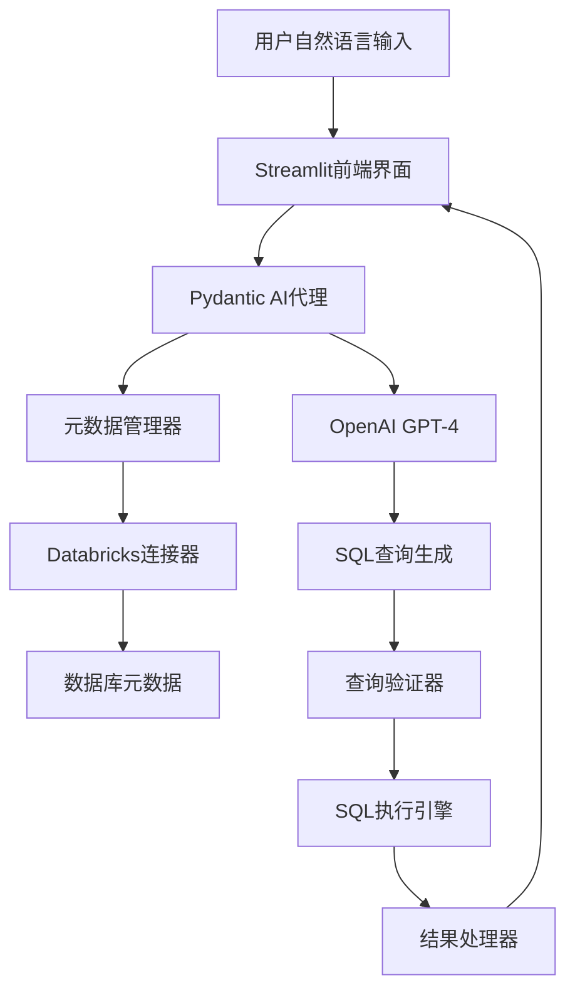

# AI数据目录智能代理

## 📖 项目简介

### 🌟 项目背景/来源
- **灵感来源**: 基于《Build an AI Agent to Explore Your Data Catalog with Natural Language》技术文章
- **原文链接**: https://towardsdatascience.com/build-and-ai-agent-to-explore-your-data-catalog-with-natural-language/
- **技术洞察**: 利用LLM和AI代理技术，构建自然语言到SQL的智能转换系统
- **现状痛点**: 
  - SQL语法复杂，对非技术用户门槛高
  - 数据库模式理解困难，需要专业知识
  - 传统自然语言查询系统缺乏灵活性和准确性
  - 缺乏上下文理解和业务逻辑推理能力
- **技术突破**: 结合LLM的自然语言理解能力与结构化输出验证，构建可靠的数据查询代理

### 💎 项目核心价值

#### 🎯 技术价值突破
- **架构创新**: LLM + Pydantic AI结构化输出 + 元数据驱动的查询生成
- **开发效率**: 将复杂SQL查询简化为自然语言交互，提升数据分析效率80%+
- **实时响应**: 基于Streamlit的交互式界面，支持实时查询和结果展示
- **准确性保障**: 通过Pydantic模式验证确保SQL输出的结构正确性

#### 💰 商业价值创造
- **降低技术门槛**: 让非技术用户也能轻松进行数据查询和分析
- **提升决策效率**: 快速获取数据洞察，支持业务决策
- **减少培训成本**: 无需专门的SQL培训，降低人力成本
- **扩展应用场景**: 适用于各种数据库系统和业务场景

#### 🌐 生态系统优势
- **技术栈现代化**: OpenAI GPT-4 + Pydantic AI + Streamlit + Databricks
- **可扩展架构**: 支持多种数据库连接器和查询引擎
- **开源生态**: 基于成熟的开源技术栈，便于扩展和维护
- **云原生支持**: 与Databricks等云数据平台深度集成

## 🎯 项目目标

### 核心功能目标
1. **自然语言查询**: 支持用户用自然语言描述数据需求
2. **智能SQL生成**: 自动将自然语言转换为准确的SQL查询
3. **元数据感知**: 基于数据库模式和元数据进行智能推理
4. **结果可视化**: 提供友好的查询结果展示界面
5. **查询验证**: 确保生成的SQL语法正确且安全

### 技术实现目标
- 🔧 **模块化设计**: 清晰的代码结构，易于维护和扩展
- 🚀 **高性能**: 快速响应用户查询请求
- 🛡️ **安全可靠**: 防止SQL注入，确保数据安全
- 📊 **可观测性**: 支持查询日志和性能监控

## 🚀 快速开始

### 环境要求
- Python 3.12+
- OpenAI API密钥
- Databricks工作空间访问权限

### 安装步骤

```bash
# 1. 克隆项目
git clone <repository-url>
cd ai-data-catalog-agent

# 2. 创建虚拟环境
conda create -n sql-agent python=3.12
conda activate sql-agent

# 3. 安装依赖
pip install pydantic-ai openai streamlit databricks-sql-connector

# 4. 配置环境变量
cp .env.example .env
# 编辑.env文件，添加必要的API密钥和数据库连接信息

# 5. 启动应用
streamlit run main.py
```

### 配置说明

在`.env`文件中配置以下参数：

```env
# OpenAI配置
OPENAI_API_KEY=your_openai_api_key

# Databricks配置
DATABRICKS_SERVER_HOSTNAME=your_databricks_hostname
DATABRICKS_HTTP_PATH=your_http_path
DATABRICKS_ACCESS_TOKEN=your_access_token
```

## ✨ 功能特性

### 🧠 智能查询引擎
- **自然语言理解**: 支持复杂的业务查询描述
- **上下文感知**: 基于数据库模式进行智能推理
- **多表关联**: 自动识别表间关系，生成JOIN查询
- **聚合分析**: 支持COUNT、SUM、AVG等聚合函数

### 🔧 技术架构特性
- **结构化输出**: 使用Pydantic AI确保SQL输出格式正确
- **元数据驱动**: 基于数据库元数据进行查询优化
- **错误处理**: 完善的异常处理和用户反馈机制
- **可扩展性**: 支持多种数据库连接器

### 🎨 用户界面特性
- **实时交互**: Streamlit提供的现代化Web界面
- **查询历史**: 保存和回顾历史查询记录
- **结果导出**: 支持CSV、Excel等格式导出
- **可视化图表**: 集成数据可视化功能

## 🏗️ 技术架构

### 系统架构图



### 核心组件

1. **AI代理核心** (`agent.py`)
   - 基于Pydantic AI的结构化代理
   - 集成OpenAI GPT-4模型
   - 支持系统提示词和上下文管理

2. **元数据管理** (`metadata.py`)
   - 数据库连接管理
   - 表结构和字段信息提取
   - 元数据缓存和更新机制

3. **查询引擎** (`query_engine.py`)
   - SQL查询生成和验证
   - 查询执行和结果处理
   - 错误处理和重试机制

4. **用户界面** (`main.py`)
   - Streamlit Web应用
   - 交互式查询界面
   - 结果展示和导出功能

## 📊 使用示例

### 基本查询示例

```python
# 自然语言输入示例
user_query = "显示销售额最高的前10个产品"

# 系统自动生成的SQL
generated_sql = """
SELECT product_name, SUM(sales_amount) as total_sales
FROM sales_data
GROUP BY product_name
ORDER BY total_sales DESC
LIMIT 10;
"""
```

### 复杂查询示例

```python
# 复杂业务查询
user_query = "分析过去6个月每个地区的客户增长趋势"

# 生成的复杂SQL查询
generated_sql = """
SELECT 
    region,
    DATE_TRUNC('month', registration_date) as month,
    COUNT(DISTINCT customer_id) as new_customers,
    LAG(COUNT(DISTINCT customer_id)) OVER (
        PARTITION BY region 
        ORDER BY DATE_TRUNC('month', registration_date)
    ) as prev_month_customers
FROM customers
WHERE registration_date >= CURRENT_DATE - INTERVAL '6 months'
GROUP BY region, DATE_TRUNC('month', registration_date)
ORDER BY region, month;
"""
```

## 🔧 开发指南

### 项目结构

```
ai-data-catalog-agent/
├── README.md                 # 项目说明文档
├── main.py                   # Streamlit主应用
├── agent.py                  # AI代理核心逻辑
├── metadata.py               # 元数据管理
├── query_engine.py           # 查询引擎
├── utils.py                  # 工具函数
├── requirements.txt          # 项目依赖
├── .env.example             # 环境变量示例
├── .gitignore               # Git忽略文件
├── tests/                   # 测试代码
│   ├── test_agent.py
│   ├── test_metadata.py
│   └── test_query_engine.py
├── examples/                # 使用示例
│   ├── basic_queries.py
│   └── advanced_queries.py
└── docs/                    # 详细文档
    ├── api_reference.md
    ├── deployment_guide.md
    └── troubleshooting.md
```

### 扩展开发

1. **添加新的数据库支持**
   - 实现新的连接器类
   - 扩展元数据提取逻辑
   - 更新查询生成规则

2. **增强AI能力**
   - 优化系统提示词
   - 添加查询示例库
   - 实现查询结果反馈机制

3. **界面功能扩展**
   - 添加数据可视化组件
   - 实现查询模板功能
   - 支持多用户会话管理

## 🚀 部署指南

### 本地部署

```bash
# 启动开发服务器
streamlit run main.py --server.port 8501
```

### Docker部署

```dockerfile
FROM python:3.12-slim

WORKDIR /app
COPY requirements.txt .
RUN pip install -r requirements.txt

COPY . .
EXPOSE 8501

CMD ["streamlit", "run", "main.py", "--server.address", "0.0.0.0"]
```

### 云平台部署

- **Streamlit Cloud**: 直接连接GitHub仓库部署
- **Heroku**: 使用Procfile配置部署
- **AWS/Azure**: 容器化部署到云平台

## 🔒 安全考虑

### SQL注入防护
- 使用参数化查询
- 输入验证和清理
- 查询权限控制

### 数据访问控制
- 基于角色的访问控制
- 敏感数据脱敏
- 查询日志审计

### API安全
- OpenAI API密钥安全存储
- 请求频率限制
- 错误信息脱敏

## 📈 性能优化

### 查询优化
- 元数据缓存机制
- 查询结果缓存
- 数据库连接池

### 响应速度
- 异步查询处理
- 流式结果返回
- 前端加载优化

## 🧪 测试策略

### 单元测试
- AI代理逻辑测试
- SQL生成准确性测试
- 元数据处理测试

### 集成测试
- 端到端查询流程测试
- 数据库连接测试
- 用户界面交互测试

### 性能测试
- 并发查询压力测试
- 大数据集查询测试
- 响应时间基准测试

## 🤝 贡献指南

### 开发环境设置
1. Fork项目仓库
2. 创建功能分支
3. 安装开发依赖
4. 运行测试套件
5. 提交Pull Request

### 代码规范
- 遵循PEP 8编码规范
- 使用类型注解
- 编写完整的文档字符串
- 保持测试覆盖率 > 80%

## 📝 更新日志

### v1.0.0 (2025-01)
- ✨ 初始版本发布
- 🔧 基础AI代理功能实现
- 🎨 Streamlit用户界面
- 📊 Databricks集成支持
- 🧪 完整测试套件

## 📄 许可证

MIT License - 详见 [LICENSE](LICENSE) 文件

## 🙏 致谢

- 感谢 Fabiana Clemente 的原创技术文章
- 感谢 OpenAI 提供的强大语言模型
- 感谢 Pydantic AI 团队的结构化输出框架
- 感谢 Streamlit 社区的优秀Web框架

## 📞 联系方式

- 项目仓库: [GitHub链接]
- 问题反馈: [Issues页面]
- 技术讨论: [Discussions页面]

---

> 🚀 **让数据查询变得简单直观，让每个人都能成为数据分析师！**