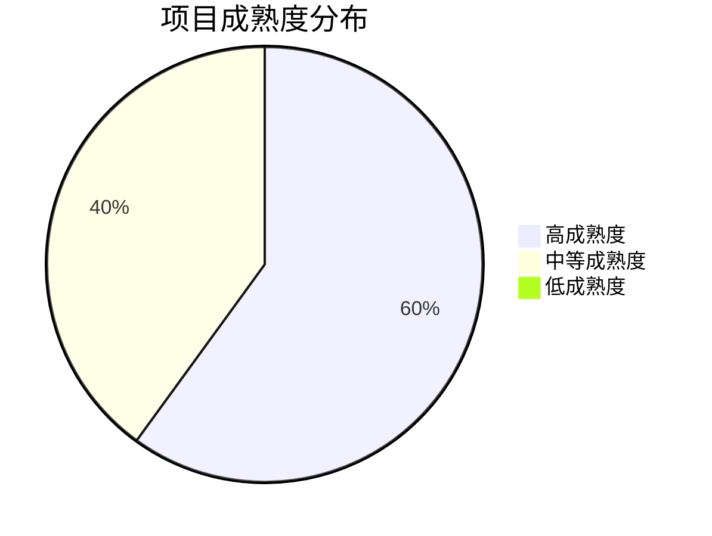
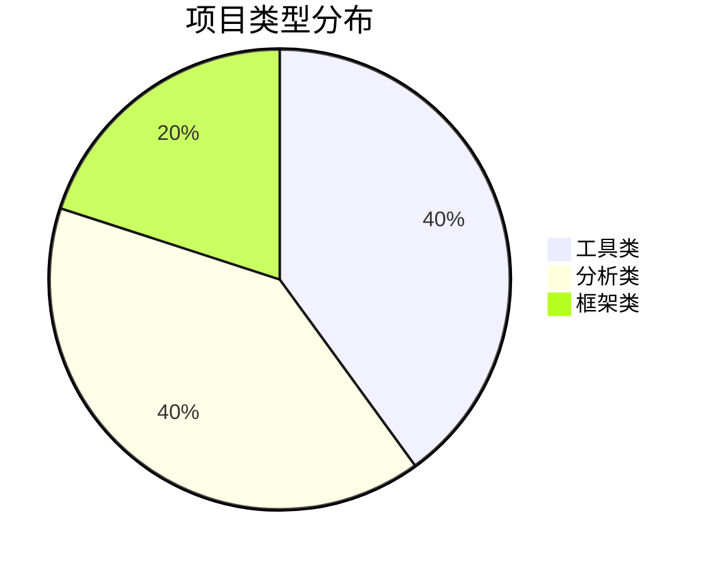
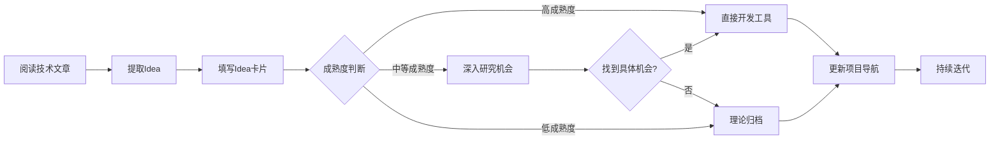
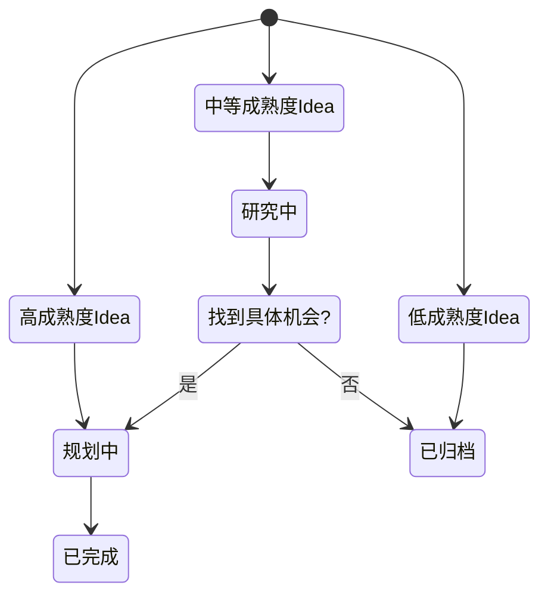
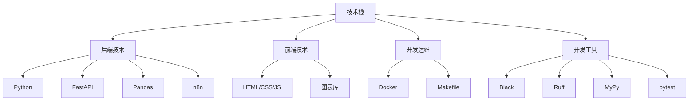
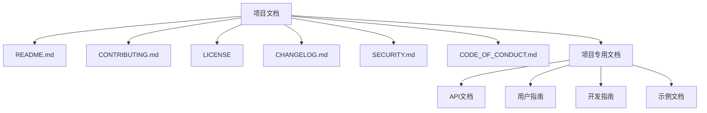

# 技术文章工具项目集合 - 项目结构图

## 项目组织结构

```mermaid
graph TD
    Root[项目根目录] --> Nav[项目导航.md]
    Root --> Rules[.trae/rules/project_rules.md]
    Root --> GitHub[GitHub项目文件]
    Root --> Projects[子项目目录]
    
    GitHub --> README[README.md]
    GitHub --> License[LICENSE]
    GitHub --> Contributing[CONTRIBUTING.md]
    GitHub --> CodeOfConduct[CODE_OF_CONDUCT.md]
    GitHub --> Security[SECURITY.md]
    GitHub --> Changelog[CHANGELOG.md]
    GitHub --> GitIgnore[.gitignore]
    GitHub --> IssueTemplates[.github/ISSUE_TEMPLATE]
    GitHub --> PRTemplate[.github/pull_request_template.md]
    
    IssueTemplates --> BugReport[bug_report.md]
    IssueTemplates --> FeatureRequest[feature_request.md]
    
    Projects --> AI[ai-decision-framework]
    Projects --> Clinical[clinical-data-transfer-specs]
    Projects --> DataPlatform[data-platform-decision-toolkit]
    Projects --> Dashboard[interactive-data-dashboard]
    Projects --> N8N[n8n-data-quality-analyzer]
    
    AI --> AIReadme[README.md]
    AI --> AIPy[Python代码文件]
    AI --> AITests[tests/]
    AI --> AIDocs[docs/]
    
    Clinical --> ClinicalReadme[README.md]
    
    DataPlatform --> DPReadme[README.md]
    
    Dashboard --> DashReadme[README.md]
    Dashboard --> DashPy[Python代码文件]
    Dashboard --> DashDocker[Docker配置]
    
    N8N --> N8NReadme[README.md]
    N8N --> N8NAnalysis[idea-analysis.md]
```

## 项目成熟度分布

```mermaid
pie title 项目成熟度分布
    "高成熟度" : 3
    "中等成熟度" : 2
    "低成熟度" : 0
```

## 项目类型分布

```mermaid
pie title 项目类型分布
    "工具类" : 2
    "分析类" : 2
    "框架类" : 1
```

## 项目开发流程

```mermaid
flowchart LR
    A[阅读技术文章] --> B[提取Idea]
    B --> C[填写Idea卡片]
    C --> D{成熟度判断}
    D -->|高成熟度| E[直接开发工具]
    D -->|中等成熟度| F[深入研究机会]
    D -->|低成熟度| G[理论归档]
    F --> H{找到具体机会?}
    H -->|是| E
    H -->|否| G
    E --> I[更新项目导航]
    G --> I
    I --> J[持续迭代]
```

## 项目状态流转

```mermaid
stateDiagram-v2
    [*] --> 高成熟度Idea
    [*] --> 中等成熟度Idea
    [*] --> 低成熟度Idea
    
    高成熟度Idea --> 规划中
    中等成熟度Idea --> 研究中
    低成熟度Idea --> 已归档
    
    规划中 --> 已完成
    研究中 --> 找到具体机会?
    找到具体机会? --> 规划中: 是
    找到具体机会? --> 已归档: 否
```

## 技术栈分布

```mermaid
graph TD
    Tech[技术栈] --> Backend[后端技术]
    Tech --> Frontend[前端技术]
    Tech --> DevOps[开发运维]
    Tech --> Tools[开发工具]
    
    Backend --> Python[Python]
    Backend --> FastAPI[FastAPI]
    Backend --> Pandas[Pandas]
    Backend --> N8N[n8n]
    
    Frontend --> HTML[HTML/CSS/JS]
    Frontend --> Charts[图表库]
    
    DevOps --> Docker[Docker]
    DevOps --> Makefile[Makefile]
    
    Tools --> Black[Black]
    Tools --> Ruff[Ruff]
    Tools --> MyPy[MyPy]
    Tools --> Pytest[pytest]
```

## 项目文档结构

```mermaid
graph TD
    Docs[项目文档] --> Readme[README.md]
    Docs --> Contributing[CONTRIBUTING.md]
    Docs --> License[LICENSE]
    Docs --> Changelog[CHANGELOG.md]
    Docs --> Security[SECURITY.md]
    Docs --> CodeOfConduct[CODE_OF_CONDUCT.md]
    Docs --> ProjectDocs[项目专用文档]
    
    ProjectDocs --> ApiDocs[API文档]
    ProjectDocs --> UserGuides[用户指南]
    ProjectDocs --> DevGuides[开发指南]
    ProjectDocs --> Examples[示例文档]
```